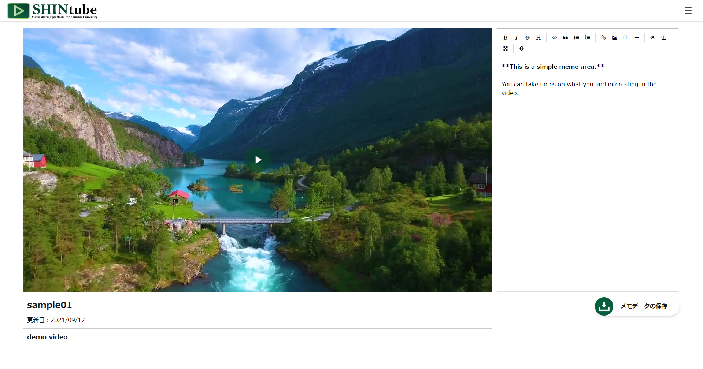

# SHINtube
Video sharing platform for Shinshu University.

SHINtubeはLTIを利用して認証認可を行う動画配信プラットフォームのフロントエンドです。
利用の際はバックエンドの[penM000/eALPluS-video-api](https://github.com/penM000/eALPluS-video-api)及び、LTIが利用可能なLMSが必要になります。



## 機能
- LMSとの連携
    - LMSへの動的登録
	- LMS上の学籍番号・授業コードによる認証認可
	- LMS上での権限による利用制限
	- グレーディングサービスの利用
		- 動画の視聴進捗の送信
		- 動画の視聴完了の送信
    - LTI Deep Linkingの利用
- 学生・教師共通機能
	- 動画視聴
    - メモ機能
- 教師専用機能
    - 動画のアップロード・編集
    - アップロード動画の一覧表示
    - LTI Deep Linkの生成

## 動作環境
### 動作確認済み環境
- Linux / macOS / Windows
- Node.js 12.x,14.x,16.x
- MongoDB 4.4
- LMS moodle3.11.1

### 推奨環境
- [kuropengin/docker-SHINtube](https://github.com/kuropengin/docker-SHINtube)
- LMS moodle3.10 ~

## セットアップ
### SHINtube
- Step.0:Node.js,npm インストール
- Step.1:任意の場所でGitのリポジトリをクローン
```bash
git clone https://github.com/kuropengin/SHINtube
```
- Step.2:ダウンロードしたフォルダに移動後、パッケージをインストール
```bash
cd ./SHINtube
npm install
```
- Step.3:configファイルの編集
- Step.4:起動
```bash
npm start
```
### MongoDB
SHINtubeは、デフォルトでmongoDBをネイティブに使用してLTIの情報を保存および管理を行う為、インストールする必要があります。詳細な手順については、以下のリンクを参照してください。
 - [mongoDBのインストール](https://docs.mongodb.com/manual/administration/install-community/)
### eALPluS-video-api
SHINtubeは、デフォルトでeALPluS-video-apiをネイティブに使用して動画のエンコード・保存および管理を行う為、インストールする必要があります。詳細な手順については、以下のリンクを参照してください。
 - [eALPluS-video-apiのインストール](https://github.com/penM000/eALPluS-video-api)

## ドキュメンテーション
 - [LMSへの登録について](./docs/RegistrationLMS.md)
 - [configファイルについて](./docs/ConfigSetting.md)
 - [動画のアップロードについて](./docs/SHINtubeManual.md#動画のアップロード・編集)
 - [DeepLinkについて](./docs/SHINtubeManual.md#DeepLinkについて)
 - [グレーディングサービスについて](./docs/SHINtubeManual.md#グレーディングサービスについて)
 - [利用規約について](./docs/AboutManual.md)

## 貢献
[GitHub](https://github.com/kuropengin/SHINtube)で私たちに⭐を頂けると嬉しいです！

バグを見つけたり、理解しにくいと感じた場合は、遠慮なく[問題](.github/CONTRIBUTING.md)を開いてください。

## 特別な感謝
開発全体を通してサポートしてくれた信州大学およびバックエンド開発者の[penM000](https://github.com/penM000)に感謝します。

## Licence
[LICENSE](.github/LICENSE)