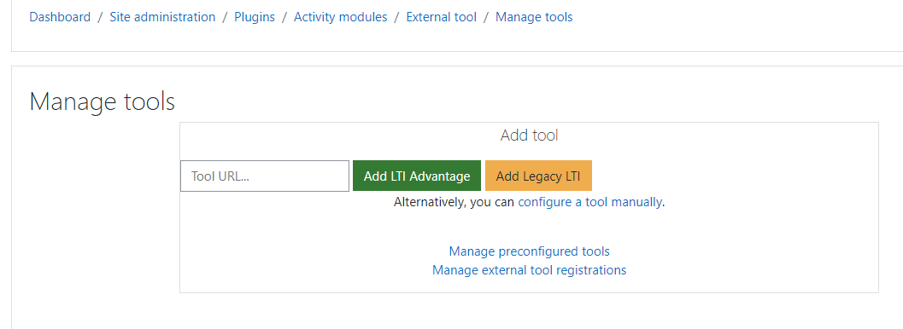
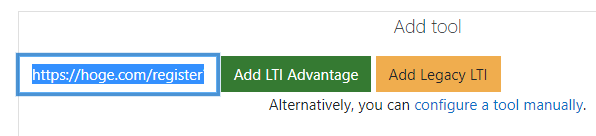
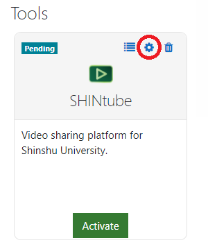
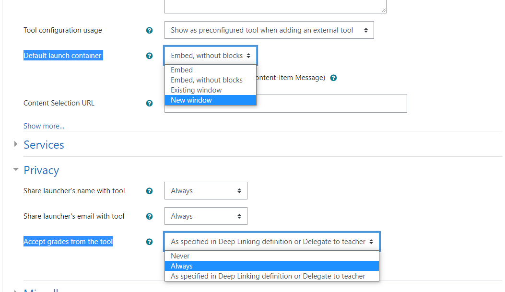
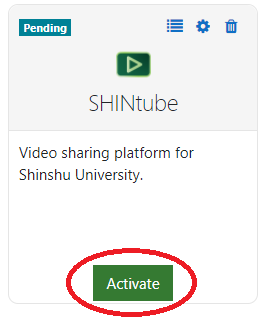
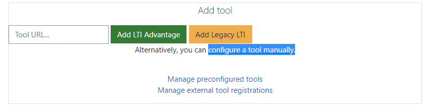
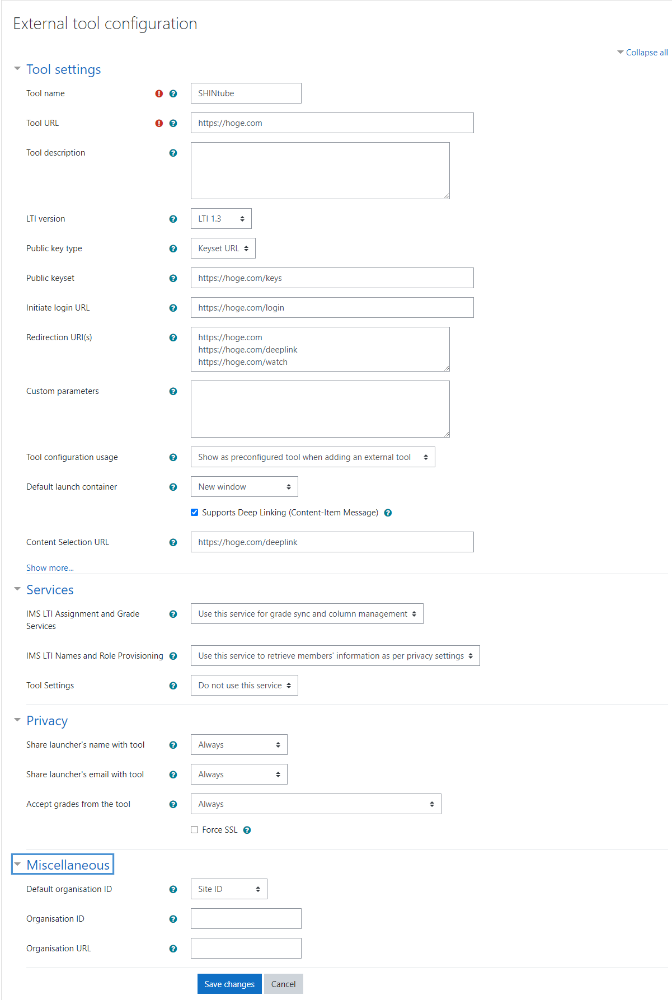
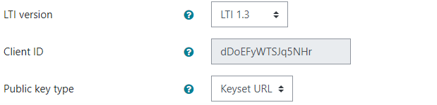

# LMSへの登録について
SHINtubeはLTIを利用できるLMSとの連携を想定して作成されていますが、推奨のLMSはmoodle3.10~です。
その為、以降の解説はmoodleとの連携方法の解説となります。

## 動的登録機能による外部ツール登録(推奨)
※動的登録機能はmoodle3.10以降で利用できる機能です。

### Step.1 : moodleの"Manage tools"ページにアクセス



### Step.2 : Add Tool内のURL入力欄に`https://<your domain>/register?regkey=<`[your setting regkey](./ConfigSetting.md#reg_key)`>` を入力して"Add LTI Advantage"ボタンをクリック



### Step.3 : "Manage tools"ページに新たに追加されたSHINtube(外部ツール)の歯車マークをクリック



### Step.4 : "Default launch container"を"New window"に、"Accept grades from the tool"を"Always"に変更して保存



### Step.5 : Activateボタンを押してSHINtube(外部ツール)を有効化



## lti_configファイルによる外部ツール登録

### Step.1 : moodleの"Manage tools"ページ内の"configure a tool manually"をクリック



### Step.2 : 下記の図のように各内容を入力して保存※`https://hoge.com`は適宜変更してください



### Step.3 : "Manage tools"ページに新たに追加されたSHINtube(外部ツール)の歯車マークをクリック


### Step.4 : 生成された"Client ID"を保存



### Step.5 : "/SHINtube/config/lti_config.json"内の"platform"に下記のように入力

```bash
"platform" : [
    {
        "name" : "moodle", #任意の名称
        "url" : "https://lms.com", #LMSのURL
        "key" : "dDoEFyWTSJq5NHr" #Step.4で保存したClient ID
    }
]
```

### Step.6 : SHINtubeを再起動
